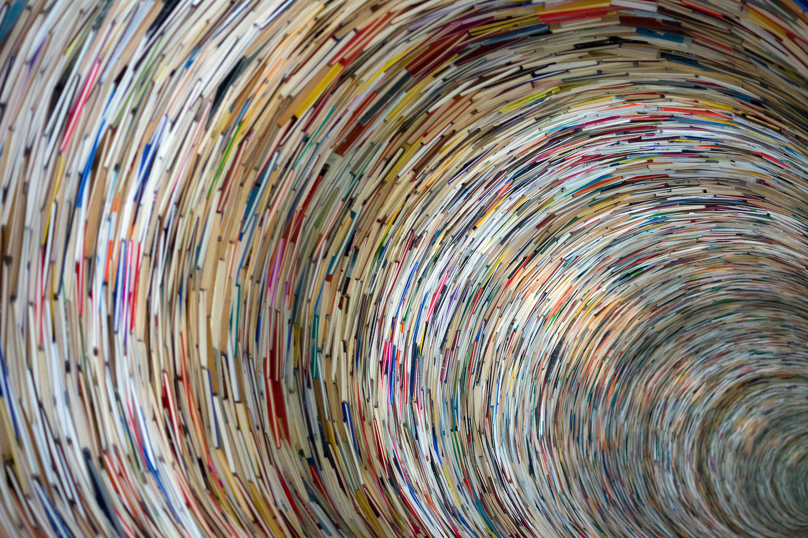

  
<br>

###Purpose  
To explore R books. How we use them, value them, and discuss them.  

###Lists  
**Blogs**  
So many great books lists for computation and R. Here is a brief list scraped from blog posts captured by [R-bloggers](https://www.r-bloggers.com).   

```{r, blogs, warning=FALSE, message=FALSE}
library(tidyverse)
blogs <- read_csv("data/blogs.csv") %>%
  arrange(desc(count))
knitr::kable(blogs[1:10, ])

```

**Citations**  
The Web of Science also shockingly now indexes citations to books.  
```{r, citations, warning=FALSE, message=FALSE}
library(tidyverse)
citations <- read_csv("data/citations.csv") 
knitr::kable(citations[1:10, ])

```

**R Meetup**  
A brief survey of local R users.  
```{r, survey, warning=FALSE, message=FALSE}
library(tidyverse)
#meetup <- read_csv("data/meetup.csv")
#knitr::kable(meetup[1:10, ])

```


###Data viz  

###Interpretations  
1. Context matters.  
2. Citations, use, and influence are not always the same.  
3. There is hope for books.  